# Lab-02 การใช้งาน Plantuml   
----
## หมายเหตุ เมื่อทำการทดลองแล้ว ให้บันทึกผลลงในไฟล์  [Lab-02-Answer.md](./Lab-02-Answer.md)

----
## 2.1 วัตถุประสงค์  

1. เพื่อให้นักศึกษาโปรแกรม plantUML วาด class diagram พื้นฐานได้
2. เพื่อให้นักศึกษาติดตั้งและใช้งาน plantUML ร่วมกับ visual studio code ได้ 

## 2.2 ตรวจสอบก่อนการทดลอง

- ติดตั้งโปรแกรม visual studio code รุ่นล่าสุด  
- มี account github เป็นของตนเองและสามารถใช้งานได้ตามปกติ
- สามารถใช้งาน git บน visual studio ได้

## 2.3 แนะนำโปรแกรม PlantUML

PlantUML เป็นซอฟต์แวร์ช่วยวาดภาพแผนผัง UML จากการเขียนภาษาบรรยายที่เข้าใจง่าย ข้อดีของโปรแกรมนี้คือสามารถปรับปรุงแผนผังได้ง่ายกว่าซอฟต์แวร์สร้างแผนผังแบบลากวาง 

PlantUML ทำงานได้สำเร็จโดยอาศัยความช่วยเหลือจากซอฟต์แวร์ที่ชื่อ Graph Visualization ซึ่งเป็นซอฟต์แวร์ render กราฟที่ทรงพลังตัวหนึ่ง 

ทั้ง PlantUML และ Graph Visualization เป็น Open source software สามารถเข้าถึงได้จากลิงค์ต่อไปนี้ 

PlantUML เป็นเครื่องมือสำหรับวาด  UML diagrams โดยการใช้ภาษาอย่างง่าย (human readable)

ในมุมมองของ CASE Tool (Computer-aided Software Engineering) นั้น PlantUML เหมาะที่จะเป็น drawing tool มากกว่า modeling tool.

## 2.4 ตัวอย่าง diagram ที่สามารถวาดด้วย plantUML

### 2.4.1 Class diagram

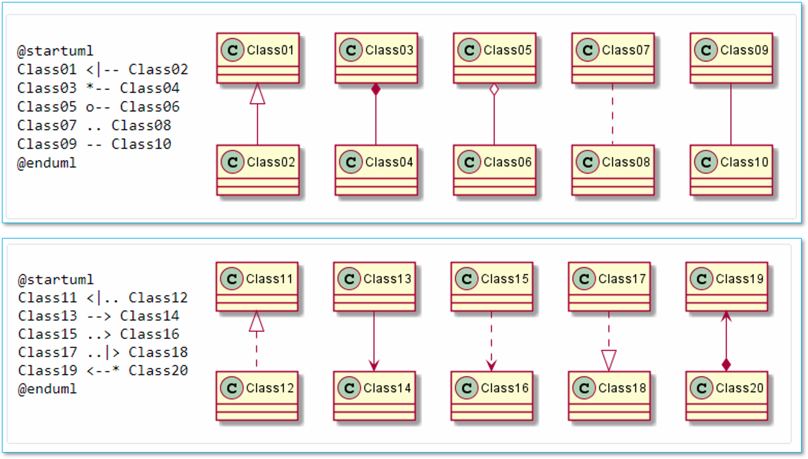

### 2.4.2 Sequence Diagram

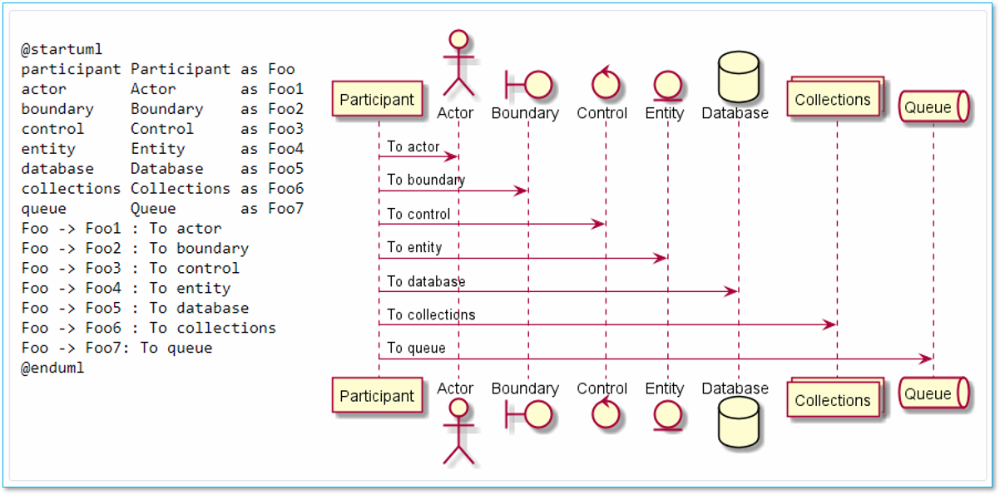

### 2.4.3  Usecase Diagram

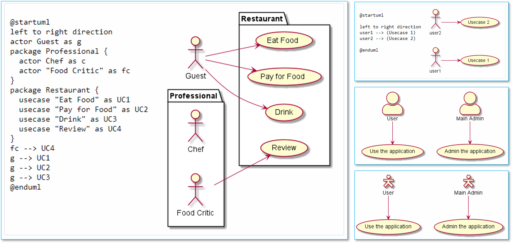 
### 2.4.4  State Diagram

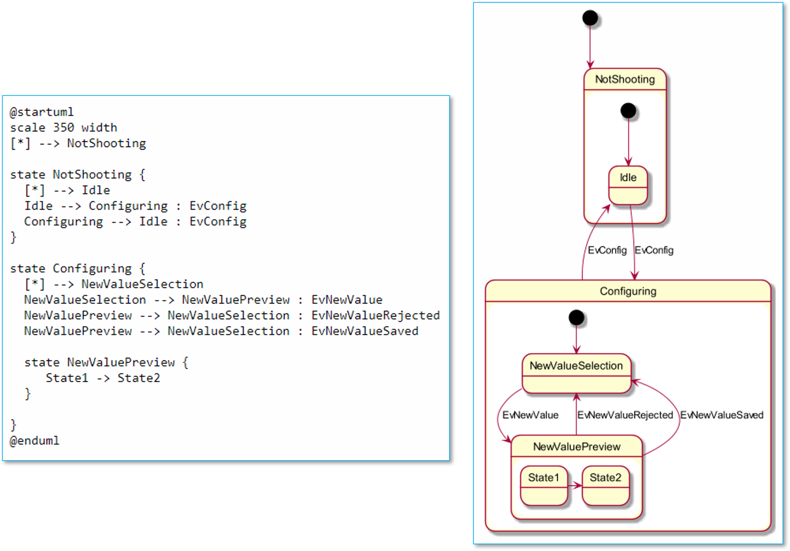 

### 2.4.5 Component Diagram
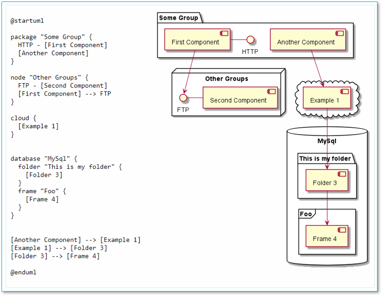 

### 2.4.6 Deployment Diagram
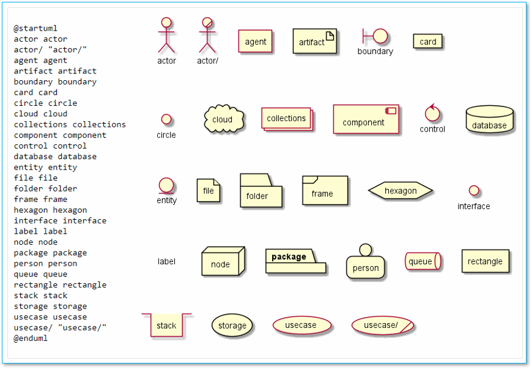 

### 2.4.7 Timing Diagram
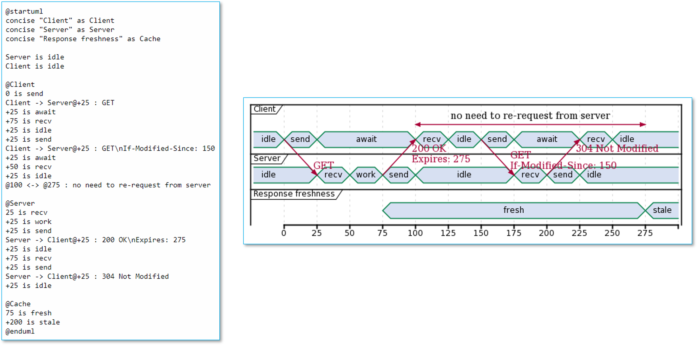 

### 2.4.8 Network diagram
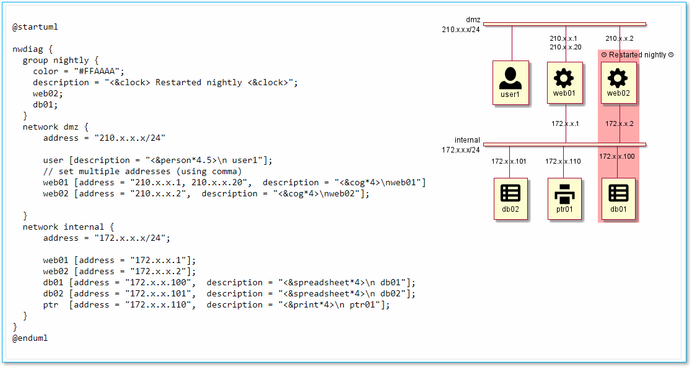 

### 2.4.9 Salt (Wireframe)
-Diagram.png) 

### 2.4.10 Archimate Diagram
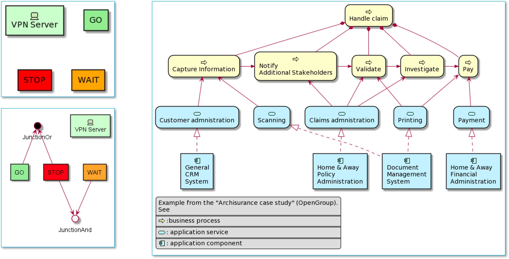 

### 2.4.11 Gantt Diagram
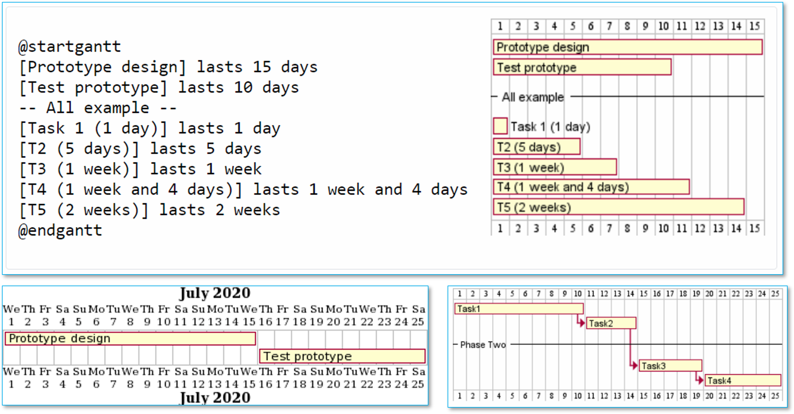 

### 2.4.12 MindMap
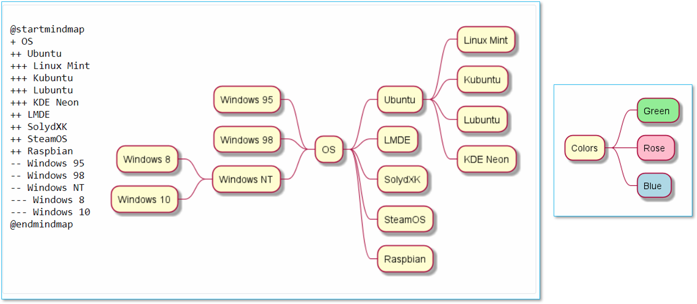 

### 2.4.13 Work Breakdown Structure (WBS)
-Diagram.png) 

### 2.4.14 Mathematic
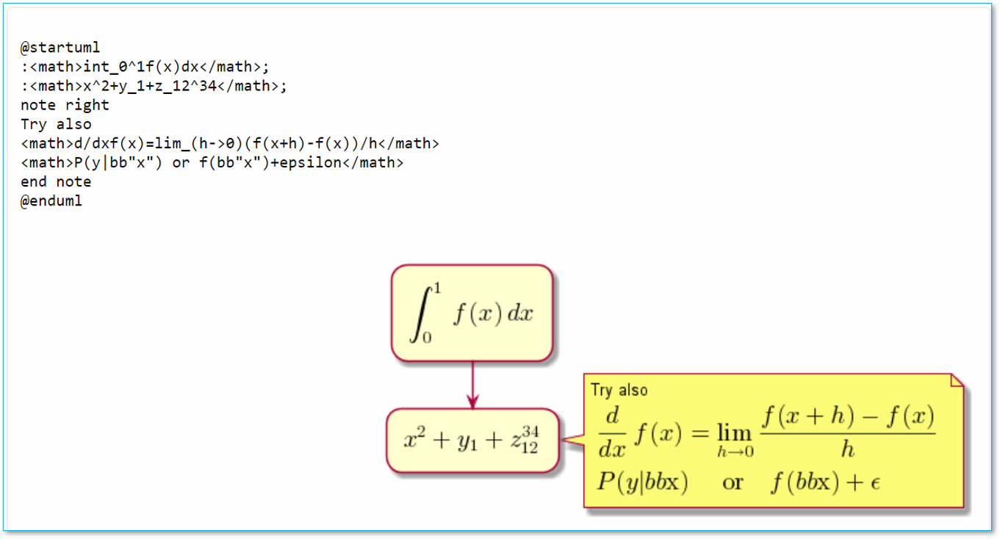 

### ไดอะแกรมแบบอื่น ๆ

## PlantUML ##
- Web site -- https://plantuml.com/ 
- Source code -- https://github.com/plantuml/plantuml 

## Graph Visualization ##
- Web site -- https://graphviz.org/ 
- Source code -- https://gitlab.com/graphviz/graphviz 

## Video แนะนำ plantuml ## 
มี 3 ตอน ประกอบด้วย 
- ตอนที่ 1 แนะนำ PlantUML https://youtu.be/Iwu3LMvIO6k 
- ตอนที่ 2 การใช้ PlantUML บน VSCode https://youtu.be/BNwNFfjtCmk 
- ตอนที่ 3 การใช้ PlantUML ร่วมกับ GraphViz แบบ offline https://youtu.be/m-_3J5BceKM

## [2.5 การใช้งาน Plantuml](./Lab-02-part-2.md)