# Lab-02 การใช้งาน Plantuml 

## 2.5 แนะนำการใช้งาน Plantuml (Online)

### 2.5.1 ส่วน user interface ของเวบและการใช้งาน
การใช้งาน Plantuml ให้เข้าไปที่หน้า homepage  ของ PlantUML ตามลิงค์นี้  http://plantuml.com/en 

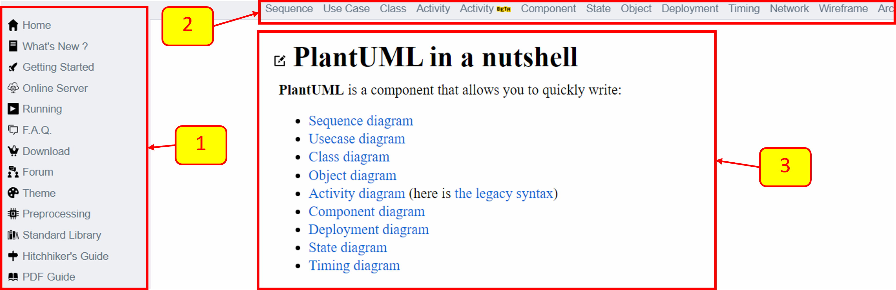

เมื่อเข้าไปยัง web site ดังกล่าว จะเห็นหน้าเพจดังรูป ซึ่งมีส่วนติดต่อผู้ใช้อยู่ 3 ส่วนหลักๆ คือ 

1. ส่วนเมนูหลัก
2. ส่วนเลือกชนิดของไดอะแกรม
3. ส่วนเนื้อหา

ให้คลิกที่เมนูส่วนที่สอง ในหัวข้อ class diagram จะปรากฏตัวอย่างการเขียน code เพื่อสร้าง class diagram ดังรูป

จะสังเกตุว่าด้านขวามือของ web browser จะมีเมนูย่อยสำหรับการกระโดดไปที่ตัวอย่างแต่ละหัวข้อ

ในหน้าต่างนี้เราสามารถแบ่งส่วนที่น่าสนใจได้ 3 ส่วน ได้แก่

1. ส่วนเมนูจัดการ code ซึ่งมี 2 ปุ่มให้เรียกใช้คือ `Copy to clipboard` และ `Edit online`
2. ส่วนของ Code
3. ส่วนของ graphics ที่ได้จากการ render ของ code ที่เขียนในส่วนที่ 2 

ในหัวข้อนี้ ให้นักศึกษาเริ่มจากตัวอย่างง่าย ๆ ได้แก่การสร้าง class รวมถึง element ต่าง ๆ ที่ใช้ในคลาสไดอะแกรม (ความหมายและการใช้งานของ element ต่าง ๆ นั้นเราจะทยอยเรียนไปตามลำดับเนื้อหา)  

เราสามารถทดลองแก้ไข code และ graphics ได้ด้วยใช้ online editor โดยการกดปุ่ม Edit online (เป็นปุ่มกดอยู่ในส่วนที่ 1 ของรูปด้านบน)

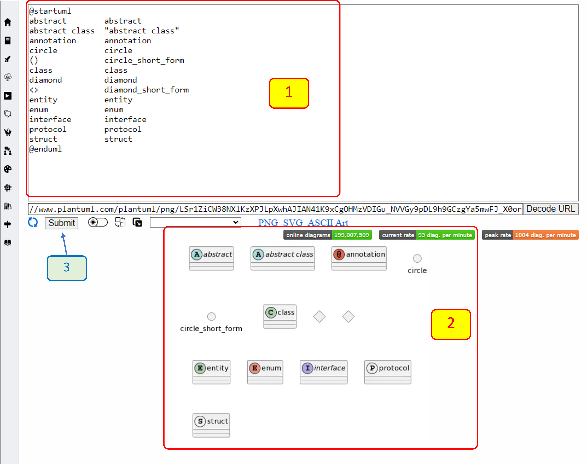

เมื่อเข้ามาในหน้า Edit online แล้วจะพบว่ามีส่วนที่น่าสนใจอยู่ 2 ส่วนคือ 

1. ส่วนของ code ที่สามารถแก้ไขได้
2. ส่วนแสดง graphic ที่ได้จาการเขียน code 

โดยเมื่อแก้ไข code แล้วเราสามารถสั่งให้หน้าเวบทำการ render ส่วนของ graphic ใหม่โดยการกดปุ่ม Submit [3]

### 2.5.2 การเพิ่ม properties และ methods 

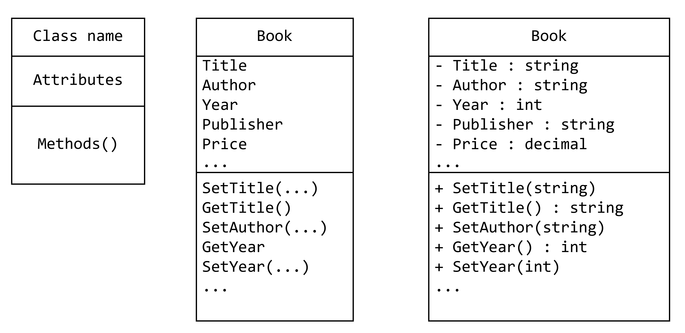

1. การเขียนคลาสอย่างง่าย

ในการเขียน class diagram บน plantUML เราสามารถเขียนคลาสอย่าง่ายโดยมีแค่ชื่อคลาสหรือสามารถใส่ attributes และ methods ได้ 

รูปแบบการเขียน  code สำหรับ plantUML จะต้องเริ่มด้วยคำว่า `@startuml` และจบด้วยคำว่า `@enduml` เสมอ

การเขียน class จะใช้รูปแบบดังนี้

``` plantuml
@startuml
class ClassName
{
' ภายในวงเล็บปีกกาคือ class body   
}
@enduml
```

ภายใน class body จะประกอบด้วย attributes และ Methods โดย plantUML จะจำแนกความแตกต่างระหว่าง attributes และ methods  จากเครื่องหมายวงเล็บหลังชื่อ ถ้ามีวงเล็บจะถูกจัดให้เป็น methods โดยอัตโนมัติ และไม่สนใจตำแหน่งที่ปรากฏใน code ของ plantUML

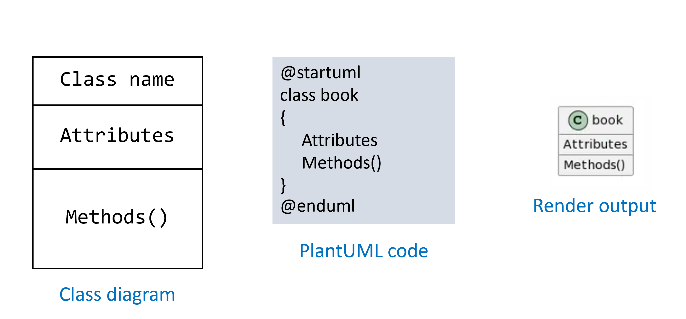

2. การเพิ่ม Attributes และ Methods ให้คลาส

เมื่อโปรแกรมมีความซับซ้อนมากขึ้น คลาสของเราก็อาจจะมีความซับซ้อนมากขึ้น plantUML ก็มีรูปแบบการเขียนไว้รองรับเช่นกัน พิจารณาจากรูปต่อไปนี้

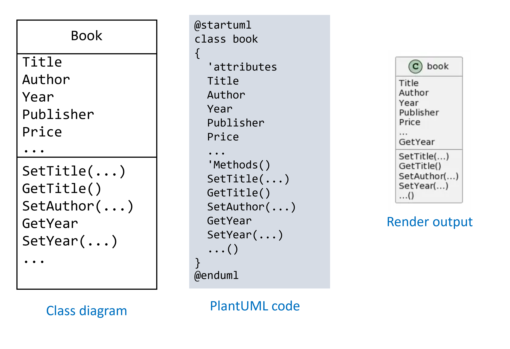

3. การเพิ่ม Data type ให้ Attributes และ Methods 

ในการระบุ attributes และ methods เราอาจจะต้องระบุชนิดของข้อมูล เพื่อให้ส่วนอื่นของโปรแกรมที่ใช้งานคลาสได้เตรียม code ที่เหมาะสมในการส่งพารามิเตอร์หรือนำผลลัพธ์ไปใช้

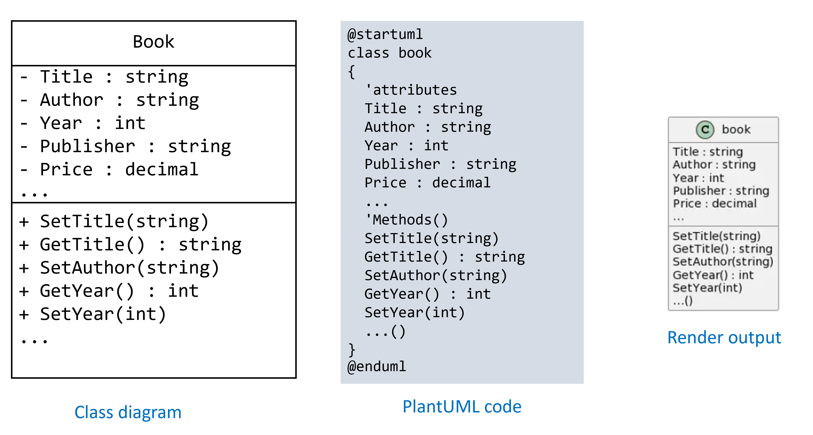

### 2.5.3 การกำหนด  visibility ให้กับส่วนประกอบต่างๆ ของคลาส 

คลาสคือการทำ encapsulation ซึ่งต้องมีความสามารถในการตวบคุมการเข้าถึง attributes หรือ methods ในคลาส เราสามารถใช้เครื่องหมายต่างๆ เพื่อควบคุมการเข้าถึง attributes และ methods ซึ่งจะให้ผลการ render ที่แตกต่างกัน พิจารณาจากรูปด้านล่าง

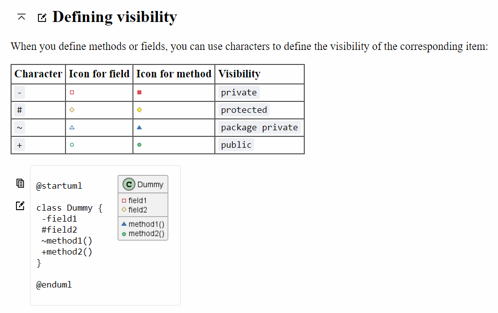

ตัวอย่างการเขียน code ที่มีการกำหนด visibility ใน plantUML

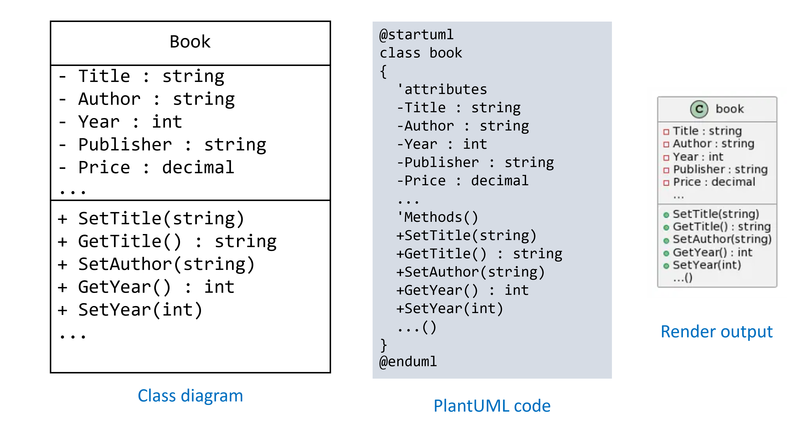

### 2.5.4 การแสดงความสัมพันธ์ระหว่างคลาส 

ใน class diagram เราต้องแสดงความสัมพันธ์ระหว่างคลาส เพื่อบอกเรื่องราวที่ได้วิเคราะห์จาก problem domain 

ใน plantUML ก็มีเทคนิคในการเขียน code เพื่อให้โปรแกรมได้ render ออกมาเป็น graphics ตามมาตรฐานของ UML เช่นกัน พิจารณาจากรูปต่อไปนี้

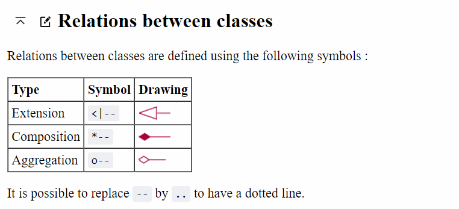

เราสามารถนำเทคนิคการเขียน code มาสร้างความสัมพันธ์ระหว่างคลาสได้ในกลายรูปแบบ

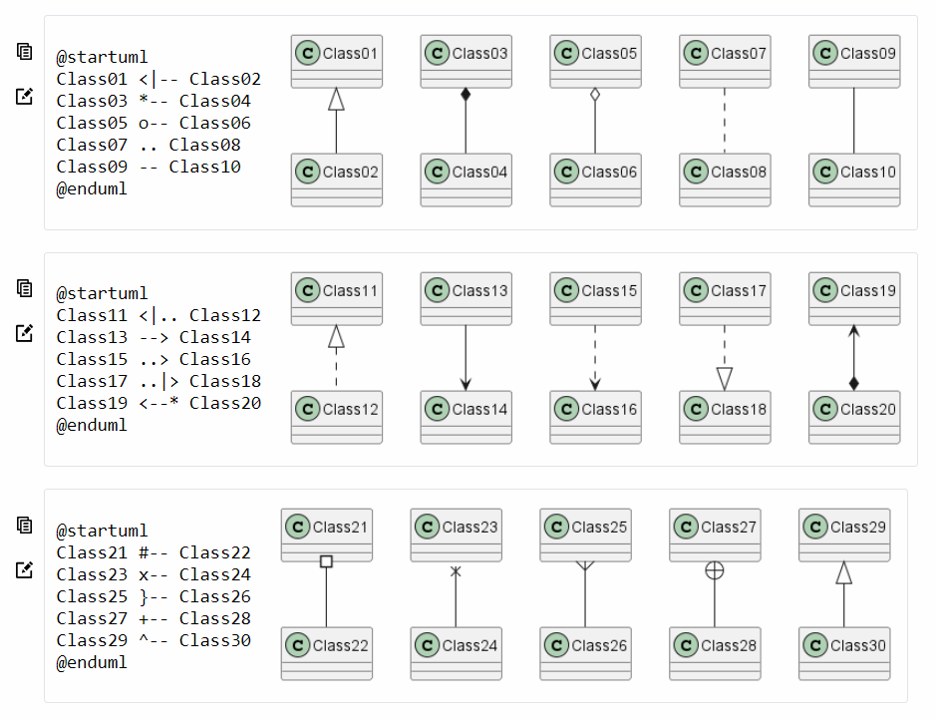

## [2.6 การทดลอง class diagram บน plantUML](./Lab-02-part-3.md) 
